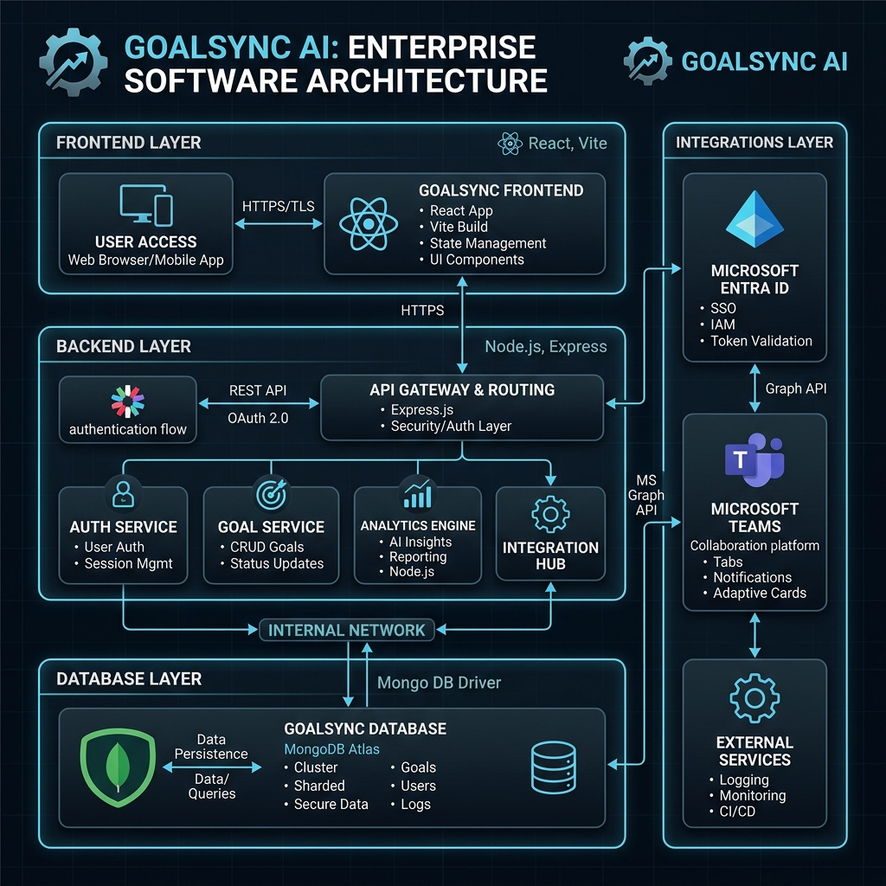

# GoalSync AI 🎯
> **Enterprise-Grade Goal Setting & Performance Tracking Portal**

<div align="center">
  
</div>

<p align="center">
  <em>An intelligent SaaS portal bridging the gap between strategic organizational KPIs and individual employee performance tracking.</em>
</p>

---

## 📖 Project Overview
Organizations relying on manual goal-tracking methods (spreadsheets, emails, fragmented tools) suffer from misalignment, blind spots, and lack of accountability. 

**GoalSync AI** eliminates these pain points by providing a structured, digitally synchronized environment. It supports the entire lifecycle of enterprise goals—from creation and managerial alignment to quarterly check-ins and live data visualization. Designed specifically for HR leaders, Managers, and Employees, the portal enforces deep organizational alignment natively.

---

## 📸 Platform Screenshots
*(Replace these with live screenshots of your deployed portal)*

<div style="display:flex; justify-content:space-between; gap: 10px;">
  
  
  
</div>

---

## 🌟 Core Enterprise Features

### Phase 1: Robust Goal Creation & Workflow
- **Mathematical Validation**: Strict client-and-server enforcement: goals must equal 100% total weightage, max 8 goals per cycle, minimum 10% weightage per goal.
- **Goal Types (UoM Engine)**: Dynamically handles calculation paths for `Min (Numeric/%)`, `Max (Cost Reduction)`, `Timeline (Dates)`, and `Zero-based` targets.
- **Manager Approval Engine**: Seamless workflow for reviewing, rejecting, or inline-editing goals. Once approved, the goal is cryptographically locked via backend state.
- **Shared Goal Sync**: Department heads set overarching KPIs (e.g. "Increase Revenue by 10%"). Linked child goals automatically sync their progress whenever the primary KPI updates.

### Phase 2: Performance Tracking & Analytics
- **Quarterly Check-ins**: Dedicated modules where users enter raw "Actual Achievements" while the system automatically generates percentage completion scores based on UoM rules.
- **Enterprise Analytics Layer**: Live Recharts implementations of Organizational Heatmaps, Manager Response Times, and Performance Distributions.
- **Escalation Rules Engine**: Automated cron jobs flag overdue check-ins or pending approvals, systematically routing reminders through Level 1 (Employee), Level 2 (Manager), and Level 3 (HR).

### Technical Differentiators
- **Full Audit Trail**: Every significant action (Approval, Rejection, Edits, Escalation triggers) is immutably logged into an `AuditLog` database table tracking user, role, and old/new values.
- **Real CSV & Excel Export**: Reports export as CSV and Excel-compatible `.xls` files without vulnerable spreadsheet dependencies.
- **SSO Ready**: Built-in visual support and database schema for Microsoft Entra ID mapping, alongside internal "MS Teams" webhook notification structures.

---

## 🧑‍💻 Role Explanations

1. **Employee (`/employee`)**: Focuses on drafting goals, submitting them against the 100% cap, and executing quarterly check-ins. 
2. **Manager (`/manager`)**: Focuses on the "Approvals" dashboard, utilizing inline-editing, pushing back drafts, and monitoring team compliance.
3. **Admin / HR (`/admin`)**: Oversees the entire organization via the Audit Trail, Analytics suite, and Escalation monitors. Possesses global "unlock" powers.

---

## 🏗️ Architecture & Tech Stack

### Frontend (Client-Side)
- **Framework**: React 19 + Vite
- **Routing**: React Router 7 (Protected Routes via `ProtectedRoute.jsx`)
- **State Management**: API-driven React state backed by the Express/MongoDB service.
- **Styling**: TailwindCSS + Custom modular CSS
- **Data Visualization**: Recharts (Heatmaps, Area, Doughnut)
- **Toast Notifications**: `react-hot-toast`

### Backend (Server-Side)
- **Environment**: Node.js + Express.js
- **Database Model**: MongoDB (Mongoose Schema Design encompassing 7 discrete entities: User, Goal, SharedGoal, AuditLog, Approval, Escalation, Checkin)
- **Middleware Infrastructure**: 
  - `errorHandler.js` & `asyncHandler.js` (Centralized handling)
  - `role.js` (RBAC checking `authorizeRoles("admin")`)
  - `goalValidator.js` (Express-style array and schema validation)
- **Services Layer**: Advanced abstractions via `escalationCron.js` and `sharedGoalService.js`.

---

## 🚀 Setup & Installation Guide

1. **Clone the repository:**
   ```bash
   git clone https://github.com/your-org/goalsync-ai.git
   cd goalsync-ai
   ```

2. **Install Dependencies:**
   Ensure you install both root (frontend) and server dependencies:
   ```bash
   npm install
   cd server && npm install
   ```

3. **Environment Setup:**
   Rename `.env.example` to `.env` in the root and fill in your keys. For deployment, set `VITE_API_URL` to the public backend URL and set `MONGO_URI`/`JWT_SECRET` on the backend host.

4. **Run the Application (Concurrently):**
   ```bash
   # Terminal 1 (Frontend Development Server)
   npm run dev
   
   # Terminal 2 (Backend Node Server)
   cd server
   npm run server
   ```

5. **Verify before submission:**
   ```bash
   npm run lint
   npm run build
   cd server
   npm test
   npm audit
   ```

---

## 🔑 Demo Credentials

For hackathon presentation ease, the `Login.js` screen includes **Quick Switcher** buttons to instantly route between roles. You may also directly visit:
- [localhost:5173/employee](http://localhost:5173/employee)
- [localhost:5173/manager](http://localhost:5173/manager)
- [localhost:5173/admin](http://localhost:5173/admin)

All users have access to the `/analytics` module.

---

## 🔗 Deployment Links
- **Live Demo**: *(Update with your deployed frontend URL)*
- **API Base URL**: *(Update with your deployed backend URL, e.g. Render/Railway/Fly.io)*
- **Presentation Deck**: [Figma Slides](https://figma.com) *(Update link)*

> Built with ❤️ for the Hackathon by the Antigravity Team.
